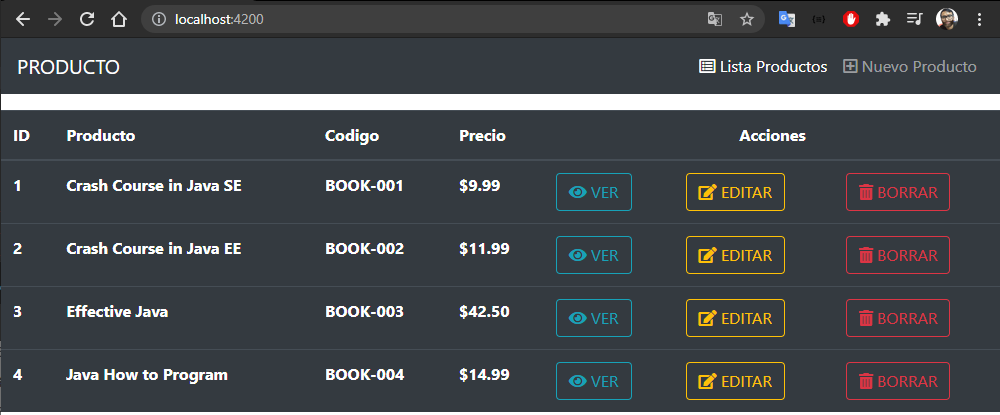

# Demo Apps SpringBoot Angular

## CRUD Básico [crud-basico](https://github.com/popehiflo/demo-apps-springboot-angular/tree/main/crud-basico)  

CRUD - `MySQL`, `Hibernate`, `Spring Boot`, `Angular`.  
Ejemplo de CRUD Basico sobre una sola tabla (Producto), sin relaciones, busqueda o paginacion.    

## Test imagen

 
 
[Angular][Spring Boot][MySQL] 
Productos ...

